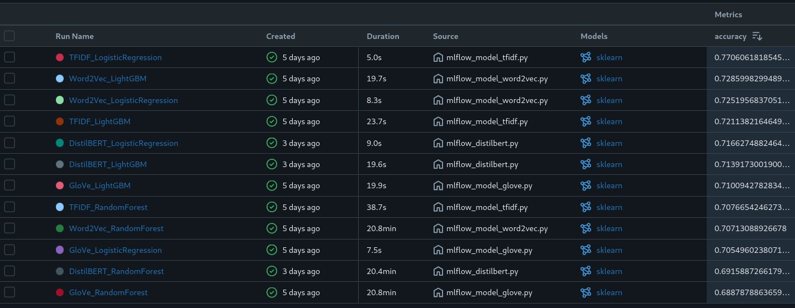

---
# You can also start simply with 'default'
theme: seriph
addons:
  - tldraw
  - slidev-addon-excalidraw
# some information about your slides (markdown enabled)
title: Projet Openclassrooms 6
info: |
  ## Slidev Starter Template
  Presentation slides for developers.

  Learn more at [Sli.dev](https://sli.dev)
# apply unocss classes to the current slide
class: text-center
# https://sli.dev/features/drawing
drawings:
  persist: false
# slide transition: https://sli.dev/guide/animations.html#slide-transitions
transition: slide-left
# enable MDC Syntax: https://sli.dev/features/mdc
mdc: true
# take snapshot for each slide in the overview
overviewSnapshots: true
hideInToc: true
---

# Projet 7 Openclassrooms

Réalisez une analyse de sentiments grâce au Deep Learning

<div class="abs-br m-6 flex gap-2">
  <a href="https://openclassrooms.com/fr/paths/795/projects/1516" target="_blank" alt="OpenClassrooms" title="OpenClassrooms"
     class="text-xl slidev-icon-btn opacity-50 !border-none !hover:text-white">
    
  </a>
  <a href="https://github.com/dimitri-feniou/openclassrooms-projet7-analyse-sentiment" target="_blank" alt="GitHub" title="Open in GitHub"
     class="text-xl slidev-icon-btn opacity-50 !border-none !hover:text-white">
    
  </a>
</div>

<!--
The last comment block of each slide will be treated as slide notes. It will be visible and editable in Presenter Mode along with the slide. [Read more in the docs](https://sli.dev/guide/syntax.html#notes)
-->
---
transition: fade-out
layout: cover
---
# _I. Présentation du contexte projet_


---
transition: fade-out
---

# Contexte Projet

- L'entreprise **Air Paradis** souhaite anticiper les bad buzz sur les réseaux sociaux
- **Problématique:** La compagnie a connu des retours négatifs sur les réseaux sociaux et souhaite pouvoir les détecter rapidement.

<div class="flex items-center gap-4">
  <div class="encart-dark flex-1">
  <strong>Notre mission :</strong><br>
  <strong>Développer un prototype d'IA pour la détection automatique du sentiment des tweets</strong> permettant d'identifier en amont les retours négatifs potentiels.
  </div>
</div>


<style>
h1 {
  background-color: #2B90B6;
  -webkit-background-clip: text;
  -moz-background-clip: text;
  -webkit-text-fill-color: transparent;
  -moz-text-fill-color: transparent;
}
.encart-dark {
  border: 2px solid #ffffff; /* Bordure blanche pour contraster avec le fond sombre */
  padding: 15px;
  border-radius: 8px;
  font-weight: bold;
  background-color: #333333; /* Fond gris foncé pour s'harmoniser avec le mode sombre */
  color: #ffffff; /* Texte blanc pour une meilleure lisibilité */
  box-shadow: 0 4px 8px rgba(0, 0, 0, 0.5); /* Ombre portée pour donner de la profondeur */
  margin: 20px 0; /* Espacement vertical pour aérer le contenu */
}
</style>

<!--
Here is another comment.
-->

---
transition: fade-out
zoom: 0.5
---

# Présentation démarche Projet

<div class="bg-gray-800 p-4 rounded-lg flex justify-center">
  
</div>


<style>
.encart-dark {
  border: 2px solid #ffffff;
  padding: 15px;
  border-radius: 8px;
  background-color: #333333;
  color: #ffffff;
  box-shadow: 0 4px 8px rgba(0, 0, 0, 0.5);
  margin: 20px 0;
}

.flex {
  display: flex;
}

.flex-1 {
  flex: 1;
}

.items-center {
  align-items: center;
}

.justify-center {
  justify-content: center;
}

.mt-4 {
  margin-top: 1rem;
}

.w-12 {
  width: 80%;
}

.h-auto {
  height: auto;
}
</style>

---
transition: fade-out
layout: cover
---
# _II.Analyse et prétraitement du jeu de données_

---
transition: fade-out
---


# Présentation du jeu de donnée
  - Jeu de donnée contenant **160000 tweets** contenant :
    - Le sentiment du tweet (négatif ou positif)
    - Le texte du tweet 
    - L'utilisateur du tweet

<div class="flex bg-gray-800 p-4 rounded-lg shadow-lg mt-8">
  <div class="w-1/2 flex justify-center items-center">
    
  </div>

  <div class="w-1/2 flex flex-col justify-center p-6 text-white">
    <h2 class="text-2xl font-semibold mb-4">Distribution des sentiments des tweets</h2>
    <p>
     Distribution équilibrée du nombre de tweet positif et négatif 
    </p>
    
  </div>
</div>

<style>
h1 {
  background-color: #2B90B6;
  -webkit-background-clip: text;
  -moz-background-clip: text;
  -webkit-text-fill-color: transparent;
  -moz-text-fill-color: transparent;
}
.encart-dark {
  border: 2px solid #ffffff; /* Bordure blanche pour contraster avec le fond sombre */
  padding: 15px;
  border-radius: 8px;
  font-weight: bold;
  background-color: #333333; /* Fond gris foncé pour s'harmoniser avec le mode sombre */
  color: #ffffff; /* Texte blanc pour une meilleure lisibilité */
  box-shadow: 0 4px 8px rgba(0, 0, 0, 0.5); /* Ombre portée pour donner de la profondeur */
  margin: 20px 0; /* Espacement vertical pour aérer le contenu */
}
</style>

---
transition: fade-out
---
# Nettoyage et pré-traitement du texte

- Supression des textes vides
- Mise en forme du texte (minuscule)
- Supression de certains symbole :
  - Suppression des urls 
  - Suppression des stopwords
  - Supression des caractères spéciaux

**Export du CSV** avec les textes nettoyés avant entrainement 

<style>
h1 {
  background-color: #2B90B6;
  -webkit-background-clip: text;
  -moz-background-clip: text;
  -webkit-text-fill-color: transparent;
  -moz-text-fill-color: transparent;
}
.encart-dark {
  border: 2px solid #ffffff; /* Bordure blanche pour contraster avec le fond sombre */
  padding: 15px;
  border-radius: 8px;
  font-weight: bold;
  background-color: #333333; /* Fond gris foncé pour s'harmoniser avec le mode sombre */
  color: #ffffff; /* Texte blanc pour une meilleure lisibilité */
  box-shadow: 0 4px 8px rgba(0, 0, 0, 0.5); /* Ombre portée pour donner de la profondeur */
  margin: 20px 0; /* Espacement vertical pour aérer le contenu */
}
</style>

---
transition: fade-out
layout: cover
---
# _III.Présentation des approches d'embbeding et classification pour l'analyse de sentiment_

---
transition: fade-out
zoom: 0.7
---

# Qu'est-ce qu'un Modèle d'Embedding ?

- **Définition** : Un modèle d'embedding transforme des mots ou des phrases en vecteurs numériques, capturant les relations sémantiques entre les termes exploitable par des algorithmes de machine learning.

- **Modèles utilisés** :
  - TFIDF : Méthode statistique basée sur la fréquence d'apparition des mots, sans prise en compte du contexte sémantique.

  - Word2Vec : Transforme les mots en vecteurs en regardant leur contexte proche, avec les méthodes Skip-gram et CBOW..

  - GloVe : Crée des vecteurs en analysant combien de fois les mots apparaissent ensemble dans un texte.

  - DistilBERT : Version simplifiée de BERT, qui comprend le sens des mots en utilisant leur contexte dans une phrase.

# Qu'est-ce qu'un Modèle de Classification ?

- **Définition** : Un modèle de classification attribue une étiquette (positif, négatif) à un texte en se basant sur ses caractéristiques.

- **Modèles utilisés** :
  - Régression Logistique : Modèle linéaire de classification binaire qui estime la probabilité qu'une observation appartienne à une classe donnée.

  - Random Forest : Combine plusieurs arbres de décision pour améliorer la précision et éviter le surapprentissage.

  - LightGBM : Algorithme qui crée des arbres de décision rapidement. Il est efficace pour les grandes bases de données

**Modèle embedding** --> transformation des tweets en représentation numérique --> **Modèle classification** entrainement prédiction du sentiment associé à chaque tweet


<style>
.encart-dark {
  border: 2px solid #ffffff;
  padding: 15px;
  border-radius: 8px;
  background-color: #333333;
  color: #ffffff;
  box-shadow: 0 4px 8px rgba(0, 0, 0, 0.5);
  margin: 20px 0;
}

.flex {
  display: flex;
}

.flex-1 {
  flex: 1;
}

.items-center {
  align-items: center;
}

.justify-center {
  justify-content: center;
}

.mt-4 {
  margin-top: 1rem;
}

.w-12 {
  width: 80%;
}

.h-auto {
  height: auto;
}
</style>

---
transition: fade-out
zoom: 0.7
---

# Résultats des Modèles - Analyse de Sentiment

<div class="text-sm border border-gray-300 p-1 rounded-md">

  | Nom de l'exécution                | Durée   | Précision |
  |-----------------------------------|---------|-----------|
  | TFIDF_LogisticRegression          | 5.0s    | 77.06%    |
  | Word2Vec_LightGBM                 | 19.7s   | 72.86%    |
  | Word2Vec_LogisticRegression       | 8.3s    | 72.52%    |
  | TFIDF_LightGBM                    | 23.7s   | 72.11%    |
  | DistilBERT_LogisticRegression     | 9.0s    | 71.66%    |
  | DistilBERT_LightGBM               | 19.6s   | 71.39%    |
  | GloVe_LightGBM                    | 19.9s   | 71.00%    |
  | TFIDF_RandomForest                | 38.7s   | 70.76%    |
  | Word2Vec_RandomForest             | 20.8min | 70.71%    |
  | GloVe_LogisticRegression          | 7.5s    | 70.54%    |
  | DistilBERT_RandomForest           | 20.4min | 69.15%    |
  | GloVe_RandomForest                | 20.8min | 68.88%    |
</div>

*Choix du modèle Distilbert+Regression Logistique*
<style>
.encart-dark {
  border: 2px solid #ffffff;
  padding: 15px;
  border-radius: 8px;
  background-color: #333333;
  color: #ffffff;
  box-shadow: 0 4px 8px rgba(0, 0, 0, 0.5);
  margin: 20px 0;
  max-width: 500px; /* Limite la largeur de l'encart */
}

/* Centre l'encart en définissant une marge automatique */
.encart-centered {
  margin-left: auto;
  margin-right: auto;
}

/* Centrer les images */
.flex {
  display: flex;
  align-items: center;
  justify-content: center;
}
</style>

---
transition: fade-out
layout: cover
---

# _IV. Du développement au déploiement_


<style>
.encart-dark {
  border: 2px solid #ffffff;
  padding: 15px;
  border-radius: 8px;
  background-color: #333333;
  color: #ffffff;
  box-shadow: 0 4px 8px rgba(0, 0, 0, 0.5);
  margin: 20px 0;
  max-width: 500px; /* Limite la largeur de l'encart */
}

/* Centre l'encart en définissant une marge automatique */
.encart-centered {
  margin-left: auto;
  margin-right: auto;
}

/* Centrer les images */
.flex {
  display: flex;
  align-items: center;
  justify-content: center;
}
</style>

---
transition: fade-out
layout: fullscreen
---

# Démarche MLOps : Du Développement au Déploiement
Principe du MLOps

<div class="encart-dark flex-1">

  - **Définition** : Le MLOps (Machine Learning Operations) est un ensemble de pratiques qui vise à déployer et maintenir des modèles de machine learning en production de manière efficace et automatisée.

- **Objectifs** :
  - Automatiser le cycle de vie des modèles ML.
  - Assurer la reproductibilité des expériences.
  - Surveiller et améliorer les performances des modèles en production.
</div>


<style>
.encart-dark {
  border: 2px solid #ffffff;
  padding: 15px;
  border-radius: 8px;
  background-color: #333333;
  color: #ffffff;
  box-shadow: 0 4px 8px rgba(0, 0, 0, 0.5);
  margin: 20px 0;
  max-width: 500px; /* Limite la largeur de l'encart */
}

/* Centre l'encart en définissant une marge automatique */
.encart-centered {
  margin-left: auto;
  margin-right: auto;
}

/* Centrer les images */
.flex {
  display: flex;
  align-items: center;
  justify-content: center;
}
</style>


---
layout: two-cols
zoom: 0.8
---

# Intégration de MLflow dans une démarche MLOps

<div class="encart-dark flex-1">

1. **Suivi des expériences** : Enregistrement systématique des paramètres, des métriques et des artefacts pour chaque expérience, assurant une traçabilité complète.

2. **Gestion des versions** : MLflow permet de versionner les modèles, les données et le code.

3. **Surveillance et gestion** : MLflow Registry offre des outils pour surveiller les performances.

- Suivi des expériences et suivi des performance des modèles 
- Enregistrement du modèle réintégrer pour intégration à l'application Flask 
</div>

::right::

<div class="flex flex-col items-center">
  
  
</div>

<style>
.encart-dark {
  border: 2px solid #ffffff;
  padding: 15px;
  border-radius: 8px;
  background-color: #333333;
  color: #ffffff;
  box-shadow: 0 4px 8px rgba(0, 0, 0, 0.5);
  margin: 20px 0;
  max-width: 500px; /* Limite la largeur de l'encart */
}

/* Centre l'encart en définissant une marge automatique */
.encart-centered {
  margin-left: auto;
  margin-right: auto;
}

/* Centrer les images */
.flex {
  display: flex;
  align-items: center;
  justify-content: center;
}
</style>

---
layout: two-cols
zoom: 0.8
---

# Déploiement en Production
Déploiement Automatisé

<div class="encart-dark flex-1">

1. Déploiement automatique via GitHub Actions 

2. Mise en place tests pour l'application

3. Hébergement de l'application Flask sur Azure App Service

**Mise en place d'un pipeline CI/CD (Intégration Continue/Déploiement Continu)**
</div>

::right::

<div class="flex flex-col items-center">
  
  
</div>

<style>
.encart-dark {
  border: 2px solid #ffffff;
  padding: 15px;
  border-radius: 8px;
  background-color: #333333;
  color: #ffffff;
  box-shadow: 0 4px 8px rgba(0, 0, 0, 0.5);
  margin: 20px 0;
  max-width: 500px; /* Limite la largeur de l'encart */
}

/* Centre l'encart en définissant une marge automatique */
.encart-centered {
  margin-left: auto;
  margin-right: auto;
}

/* Centrer les images */
.flex {
  display: flex;
  align-items: center;
  justify-content: center;
}
</style>

---
layout: two-cols
zoom: 0.8
---

# Suivi de la Performance
Suivi en Production (Azure Application Insights)

<div class="encart-dark flex-1">

1. Collecte des prédictions incorrectes.
2. Utilisation de teletry azure app insight pour renvoyer les feedback 
3. Alerte automatique (3 erreurs en 5 minutes).
4. Analyse et amélioration continue du modèle.


</div>

# Amélioration Continue
Optimisation et Réentraînement possible
1. Identifier les erreurs grâce au feedback 
2. Réentraînement du model en intégrant dans notre jeu donnée les feedbacks
3. Evaluation du modèle pour voir l'impact des feedback sur le modèle
::right::
```python
# Enregistrement de la télémétrie avec Azure Application Insights
from applicationinsights import TelemetryClient

tc = TelemetryClient('e0a1e652-439b-440b-a8bd-c6996203174b')
tc.track_event(
    'FeedbackReceived',
    properties={
        'feedback': feedback,
        'text': text,
        'predicted_sentiment': predicted_sentiment
    }
)
tc.flush()

return redirect("/")
```
<div class="flex justify-center">
  
</div>

<style>
.encart-dark {
  border: 2px solid #ffffff;
  padding: 15px;
  border-radius: 8px;
  background-color: #333333;
  color: #ffffff;
  box-shadow: 0 4px 8px rgba(0, 0, 0, 0.5);
  margin: 20px 0;
  max-width: 500px; /* Limite la largeur de l'encart */
}

/* Centre l'encart en définissant une marge automatique */
.encart-centered {
  margin-left: auto;
  margin-right: auto;
}

/* Centrer les images */
.flex {
  display: flex;
  align-items: center;
  justify-content: center;
}
</style>


---
transition: fade-out
layout: cover
---
# _V.Conclusion du Projet_


---
transition: fade-out
zoom: 0.8
---

# Conclusion

- Choix du modèle DistilBERT pour la production
- Mise en oeuvre continue des principes MLOPS pour la mise en place d'une application d'analyse de sentiment sur le cloud Azure

<style>
.encart-dark {
  border: 2px solid #ffffff;
  padding: 15px;
  border-radius: 8px;
  background-color: #333333;
  color: #ffffff;
  box-shadow: 0 4px 8px rgba(0, 0, 0, 0.5);
  margin: 20px 0;
  max-width: 500px; /* Limite la largeur de l'encart */
}

/* Centre l'encart en définissant une marge automatique */
.encart-centered {
  margin-left: auto;
  margin-right: auto;
}

/* Centrer les images */
.flex {
  display: flex;
  align-items: center;
  justify-content: center;
}
</style>

